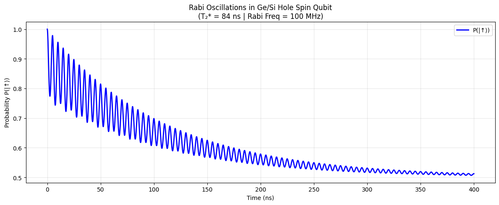

# Spin Qubit Coherence in Ge/Si Heterostructures

**Literature Review + High-Fidelity Simulation Study** using QuTiP.

## Objective
Study coherence properties (T₂*, Rabi oscillations, Ramsey decay) of hole spins in Ge/Si heterostructures and compare with experimental literature.

## Key Features
- Realistic simulation of Rabi oscillations with dephasing
- Ramsey interferometry
- Easy parameter sweeps (magnetic field, Rabi frequency, T₂*)
- Literature comparison

## Technologies
- Python, QuTiP, NumPy, Matplotlib, SciPy

## Installation

```bash
pip install -e .
